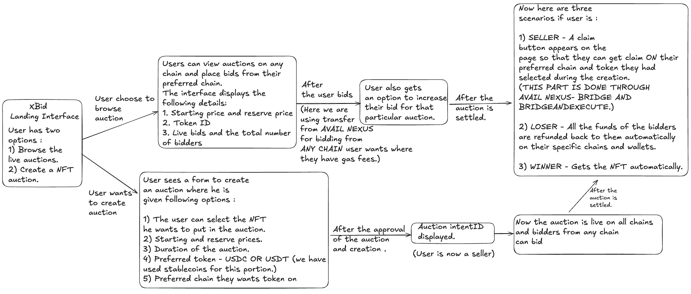

# Cross-Chain NFT Auction Platform ⛓️

**Avail Nexus × Alchemy × Chainlink × Uniswap**

A decentralized, cross-chain NFT auction platform that enables users to sell NFTs on one blockchain while accepting bids in different tokens from multiple chains. Built with Avail Nexus SDK for seamless cross-chain interoperability, making NFT auctions truly chain-agnostic.

---

## Problem Statement

The current NFT marketplace ecosystem faces several critical limitations:

1. **Chain Fragmentation**: NFT sellers are restricted to bidders on the same blockchain, fragmenting liquidity and reducing potential buyer pools.
2. **Token Rigidity**: Auctions require payment in a single specific token, limiting participation from users holding different assets.
3. **Complex User Experience**: Traditional cross-chain operations require multiple manual steps (bridging, swapping, approvals) creating friction and abandoned transactions.
4. **Missed Opportunities**: Sellers cannot access the best prices across multiple chains, and buyers cannot participate if they hold assets on different chains.

**Real-World Impact**: A seller with an NFT on Ethereum might miss higher bids from users on Arbitrum, Optimism, or Base simply because of chain boundaries.

---

## Solution: Unified Cross-Chain Auction Protocol

Our platform leverages **Avail Nexus SDK** to create a unified auction marketplace where:

- 🎨 **NFT owners on any chain** can create auctions with flexible payment preferences
- 💰 **Bidders from any supported chain** can participate using their preferred stablecoins
- 🔄 **Automatic cross-chain settlement** handles bridging, swapping, and token conversion
- 🎯 **Zero friction UX** - users stay on their native chain throughout the process

### Key Innovation: Intent-Based Auction System

Instead of forcing immediate execution, we use an **intent-based architecture**:

1. **Auction Creation**: Seller specifies desired payment token and chain
2. **Cross-Chain Bidding**: Bids lock on their native chains via BidManager contracts
3. **Backend Keeper**: Monitors all chains, aggregates bids, determines winners
4. **Flexible Settlement**: Winner's tokens are automatically bridged/swapped to seller's preference

This approach maximizes liquidity while maintaining security and decentralization.

---

## Architecture Overview

### High-Level Flow



---

## Usage Guide

### Creating an Auction

1. **Connect Wallet**: Use RainbowKit to connect MetaMask
2. **Initialize Nexus**: Click "Initialize Nexus" button (one-time per session)
3. **Navigate to Create Auction**
4. **Select Your NFT**:
   - Click "🖼️ Select from My NFTs"
   - Choose NFT from visual gallery
   - Contract address & token ID auto-filled
5. **Set Auction Parameters**:
   - Starting Price: e.g., $100 (must be > reserve)
   - Reserve Price: e.g., $80 (minimum acceptable)
   - Duration: 2 minutes to 7 days
   - Preferred Token: USDC or USDT
   - Preferred Chain: Where you want payment, where you have gas fees
6. **Approve NFT**: Click "Approve NFT Contract" (one-time per collection)
7. **Create Auction**: Submit transaction
8. **Done!**: Auction is live across all chains

### Placing a Bid

1. **Browse Auctions**: Go to `/auctions`
2. **Select Auction**: Click to see details
3. **Enter Bid Amount**: Must be ≥ starting price and > current highest bid
4. **Select Bid Chain**: Bidder can select their native chain from which they want to bid.(Where they have gas fees)
5. **Confirm Bid**:
   - If on different chain: Nexus SDK auto-bridges funds to the auction chain
   - Transaction submitted to BidManager
   - Bid locked and visible to all
6. **Track Status**: View in "My Auctions" page

### Claiming (After Auction Ends)

**For Winners**:
- All the process are automated , winner will automatically get NFT in their wallet.
- No action needed

**For Sellers**:
1. Go to "My Auctions"
2. Find ended auction with "Claim Tokens" button
3. Click to claim
4. Winning bid automatically:
   - Bridged to your preferred chain (if different)
   - Swapped to your preferred token (if different)
   - All in one transaction via Nexus SDK!

**For Losing Bidders**:
- Refunds processed automatically by keeper
- Funds returned to original chain
- No action needed

---

## Nexus SDK Integration

### Unified Cross-Chain Operations

Our platform leverages **Avail Nexus SDK** for seamless cross-chain interoperability:

- auction_cc/src/lib/nexus : Nexus SDK initialization and helper functions
- auction_cc/src/components/bridge: Nexus bridging utilities
- auction_cc/src/components/transfer: Nexus transfer utilities
- auction_cc/src/components/unified_balance: Nexus unified balance utilities
- auction_cc/src/app/my_auctions/page.tsx: Use Nexus bridge and bridgeAndExecute for claiming winning bids


### Key Nexus Features Used

| Feature | Use Case | Benefit | Why Used |
|---------|----------|---------|----------|
| **Unified Balance** | Show total USDC/USDT across all chains | Users see complete liquidity | |
| **Transfer** | Direct token transfer to auction chain | User can bid to auction on any chain using their preferred chain where they have gas fees | To enable cross-chain bidding |
| **Bridge** | Move winning bid to seller's chain | Use for cross-chain settlement | When Seller preferdChain != winnerChain but Seller's preferdToken == winnerBidToken |
| **BridgeAndExecute** | Bridge + Swap in one transaction | Convert USDT→USDC while bridging | When Seller preferdChain != winnerChain and Seller's preferdToken != winnerBidToken |

---

## Smart Contract Architecture

### Core Contracts (Solidity)

```
contracts/src/
├── AuctionHub.sol       # Main auction logic and NFT custody
├── BidManager.sol       # Multi-chain bid locking and management
├── AuctionTypes.sol     # Shared data structures and enums
└── Interfaces/
    └── IAuctionHub.sol  # Contract interfaces
```

#### 1. AuctionHub.sol
**Deployed on**: Primary chains (Sepolia, Arbitrum Sepolia, Base Sepolia, Optimism Sepolia)

**Responsibilities**:
- Create auctions with seller-defined parameters
- Lock NFTs in escrow during auction period
- Store auction metadata (starting price, reserve price, deadline, preferred token/chain)
- Settle auctions after keeper determines winner
- Transfer NFT to winner on claim
- Emit events for keeper monitoring

#### 2. BidManager.sol
**Deployed on**: ALL supported chains (Sepolia, Arbitrum, Optimism, Base)

**Responsibilities**:
- Accept and lock bids from users on any chain
- Store bid information (amount, token, timestamp)
- Release funds to seller or refund bidders post-settlement
- Support incremental bidding (users can increase bids)
- Emit bid events for keeper aggregation

---

## Keeper Architecture

### Backend Service (TypeScript)

The keeper is a **trustless backend service** that monitors blockchain events and coordinates settlements.

```
keeper/src/
├── index.ts              # Express API server
├── event-listener.ts     # Multi-chain event monitoring
├── auction-processor.ts  # Auction settlement logic
└── config.ts            # Chain configurations
```

**Events Monitored**:
- `AuctionCreated` → Store auction metadata
- `BidPlaced` → Aggregate bids from all chains
- `AuctionSettled` → Track settlement status

---

### Pages & Features

#### 1. Home Page (`/`)
- Connected wallet overview
- **Unified Balance Display** (Nexus SDK)
- Quick navigation to create/browse auctions
- Real-time Nexus initialization status

#### 2. Create Auction (`/create`)
**Innovative Features**:
-  **Visual NFT Selector**: Browse and select NFTs with images (powered by Alchemy NFT API)
-  **Auto-fill**: Click NFT → Contract address & token ID populated automatically
-  **Chain-Agnostic**: Create auction on any connected chain
-  **Flexible Duration**: From 2 minutes to 7 days
-  **Token Preference**: Choose USDC or USDT for settlement
-  **Chain Preference**: Specify destination chain for payment

#### 3. Browse Auctions (`/auctions`)
- **Live Auction Feed**: All active auctions across all chains
- **Real-Time Bidding**: Place bids from any chain
- **Cross-Chain Bid Placement**: Uses Nexus SDK for automatic transfers
- **My Bids Section**: Track all your bids and statuses

**Bid Flow**:
```typescript
// User on Optimism bidding on Arbitrum auction
1. User enters bid amount (e.g., 110 USDC)
2. Frontend calculates required transfer:
   - From: Optimism (user chain)
   - To: Arbitrum (auction chain)
   - Amount: 110 USDC

3. Nexus SDK transfer funds:
   export const result = async (token: string, amount: number, chainId: number,recipient: string,sourceChain?: number[]): Promise<TransferResult> => {
    return await sdk.transfer({
        token: token,// 'USDC' or 'USDT'
        amount: amount,
        chainId: chainId,// Destination chain (auction chain), Here Arbitrum
        recipient: recipient,
        sourceChains: sourceChain,
    } as TransferParams);
}

4. On success, call BidManager.placeBid() on Arbitrum deployment
5. Bid locked, event emitted for keeper
```

#### 4. My Auctions (`/my_auctions`)

- View all created auctions
- See current highest bid
- Cancel auctions (before bids placed)
- **Claim Winning Bid**: Automatic bridge to preferred chain/token


**Advanced Claim Logic**:
```typescript

Case 1: Same chain, same token
→ Direct transfer from BidManager to seller, no Claim button required

Case 2: Same chain, different token
→ Use Uniswap V3 swap on that chain(testnet)
-> Will use nexusSDK.swap for mainnet(code commented for testnet)

Case 3: Different chain, same token
→ Use Nexus bridge

Case 4: Different chain, different token
→ Use Nexus bridgeAndExecute (bridge + swap atomically) using Uniswap V3
```

---

## Supported Networks

### Testnets (Current Deployment)

| Network | Chain ID | AuctionHub | BidManager | Supported Tokens |
|---------|----------|------------|------------|------------------|
| **Ethereum Sepolia** | 11155111 | ✅ | ✅ | USDC, USDT |
| **Arbitrum Sepolia** | 421614 | ✅ | ✅ | USDC, USDT |
| **Base Sepolia** | 84532 | ✅ | ✅ | USDC, USDT |
| **Optimism Sepolia** | 11155420 | ✅ | ✅ | USDC, USDT |

---


## Technical Highlights

### 1. Avail Nexus SDK Integration
- **Unified Liquidity**: Users see total balances across all chains, in Navbar and while bidding.
- **Seamless Bridging**: One-click cross-chain bids
- **Atomic Execution**: Bridge + Swap in single transaction

### 2. Visual NFT Selector
- **Alchemy NFT API** integration
- Displays NFT images, names, collections
- Auto-populates contract addresses and token IDs

### 3. Intent-Based Architecture
- Sellers specify "what" they want (bid amount, preferred token/chain)
- System handles "how" (bridging, swapping, routing)

### 4. Multi-Chain Event Aggregation
- Keeper monitors 4+ chains simultaneously
- Determines winners fairly and transparently

### 5. Flexible Settlement
- 4 settlement paths automatically chosen:
  - Direct transfer (same chain, same token)
  - Uniswap swap (same chain, different token)(For testnet), Nexus Swap for Mainnet
  - Nexus bridge (different chain, same token)
  - Nexus bridgeAndExecute (different chain, different token) integrated with UniswapV3
- Optimizes for gas and speed

---

## License

This project is licensed under the **MIT License** - see the [LICENSE](LICENSE) file for details.

---

*Empowering sellers with global liquidity. Enabling buyers from any chain. Powered by Avail Nexus.*
